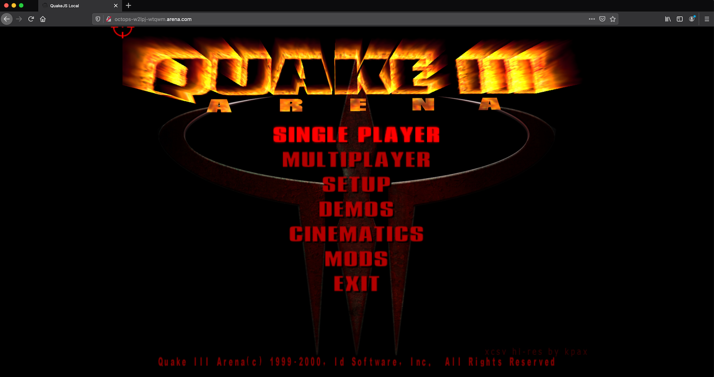
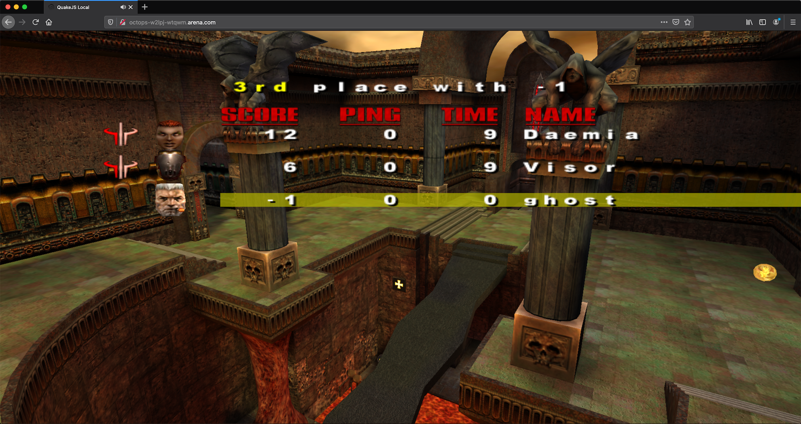
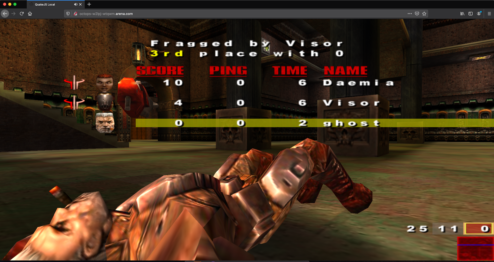

# Octops Game Server Ingress Controller
Automatic Ingress configuration for Game Servers managed by [Agones](https://agones.dev/site/).

The Octops Controller leverages the power of the [Kubernetes Ingress Controller](https://kubernetes.io/docs/concepts/services-networking/ingress-controllers/) to bring inbound traffic to dedicated game servers.

Players will be able to connect to a dedicated game server using a custom domain and a secure connection. 

## Supported Agones Resources
- Fleets
- Stand-Alone GameServers

## Use Cases
- Real-time games using websocket

## Known Limitations
For the Octops Controller to work, an Ingress Controller must be present in the cluster. The one that has been mostly adopted by the Kubernetes community is the NGINX Ingress Controller. However, it has been reported by the Agones' community that for games based on websocket the NGINX controller might not be a good fit due to the lost of connections between restarts. Check https://kubernetes.github.io/ingress-nginx/how-it-works/#when-a-reload-is-required for details.

You can find more information on the original reported issue https://github.com/Octops/gameserver-ingress-controller/issues/21.

The connection drop behaviour is also present on alternatives like the [HAProxy Ingress Controller](https://github.com/haproxytech/kubernetes-ingress).

For that reasons the suggested Ingress Controller is the [Contour Ingress Controller](https://projectcontour.io/). The controller is built on top of the https://www.envoyproxy.io/ service proxy. Envoy can handle flawlessly updates while game servers and ingress resources are reconciled by the Octops Controller. 

## Requirements
The following components must be present on the Kubernetes cluster where the dedicated game servers, and the controller will be hosted/deployed.

- [Agones](https://agones.dev/site)
  - https://agones.dev/site/docs/installation/install-agones/helm/
- [Contour Ingress Controller](https://projectcontour.io/)
  - Choose the appropriate setup depending on your environment, network topology and cloud provider. It will affect how the Ingress Service will be exposed to the internet.
  - Update the DNS information to reflect the name/address of the load balancer pointing to the exposed service. You can find this information running `kubectl -n projectcontour get svc` and checking the column `EXTERNAL-IP`.
  - The DNS record must be a `*` wildcard record. That will allow any game server to be placed under the desired domain automatically.
  - [Contour Install Instructions](https://projectcontour.io/getting-started/#install-contour-and-envoy)
- [Cert-Manager](https://cert-manager.io/docs/) - [optional if you are managing your own certificates]
  - Check https://cert-manager.io/docs/tutorials/acme/http-validation/ to understand which type of ClusterIssuer you should use.
  - Make sure you have an `ClusterIssuer` that uses LetsEncrypt. You can find some examples on [deploy/cert-manager](deploy/cert-manager).
  - The name of the `ClusterIssuer` must be the same used on the Fleet annotation `octops.io/issuer-tls-name`.
  - Install (**Check for newer versions**): ```$ kubectl apply -f https://github.com/cert-manager/cert-manager/releases/download/v1.7.1/cert-manager.yaml```

# Configuration and Manifests

## Ingress Routing Mode
The Octops controller supports 2 different types of ingress routing mode: Domain and Path.

This configuration is used by the controller when creating the ingress resource within the Kubernetes cluster.

Routing Mode is a Fleet or GameServer scoped configuration. A Fleet manifest defines the routing mode to all of its GameServers. For stand-alone GameServers, the routing mode is defined on its own manifest.

### Domain
Every game server gets its own [FQDN](https://en.wikipedia.org/wiki/Fully_qualified_domain_name#Example). I.e.:`https://octops-2dnqv-jmqgp.example.com` or `https://octops-g6qkw-gnp2h.example.com`

```yaml
# simplified Fleet manifest for Domain mode
# each GameServer is accessible using the combination: [gameserver_name].example.com
apiVersion: "agones.dev/v1"
kind: Fleet
metadata:
  name: fleet-us-east1-1
spec:
  replicas: 3
  template:
    metadata:
      annotations:
        octops-kubernetes.io/ingress.class: "contour" #required for Contour to handle ingress
        octops-projectcontour.io/websocket-routes: "/" #required for Contour to enable websocket
        octops.io/gameserver-ingress-mode: "domain"
        octops.io/gameserver-ingress-domain: "example.com"
```

Check the [examples](examples) folder for a full Fleet manifest that uses the `Domain` routing mode.

### Path
There is one global domain and gameservers are available using the URL path. I.e.: `https://servers.example.com/octops-2dnqv-jmqgp` or `https://servers.example.com/octops-g6qkw-gnp2h`

```yaml
# simplified Fleet manifest for Path mode
# each GameServer is accessible using the combination: servers.example.com/[gameserver_name]
apiVersion: "agones.dev/v1"
kind: Fleet
metadata:
  name: fleet-us-east1-1
spec:
  replicas: 3
  template:
    metadata:
      annotations:
        octops-kubernetes.io/ingress.class: "contour" #required for Contour to handle ingress
        octops-projectcontour.io/websocket-routes: "/{{ .Name }}" #required for Contour to enable websocket for exact path. This is a template that the controller will replace by the name of the game server
        octops.io/gameserver-ingress-mode: "path"
        octops.io/gameserver-ingress-fqdn: servers.example.com
```

Check the [examples](examples) folder for a full Fleet manifest that uses the `Path` routing mode.

## How it works
When a game server is created by Agones, either as part of a Fleet or a stand-alone deployment, the Octops controller will handle the provisioning of a couple of resources.

It will use the information present in the game server annotations and metadata to create the required Ingress and dependencies.

Below is an example of a manifest that deploys a Fleet using the `Domain` routing mode:
```yaml
# Reference: https://agones.dev/site/docs/reference/fleet/
apiVersion: "agones.dev/v1"
kind: Fleet
metadata:
  name: octops # the name of your fleet
  labels: # optional labels
    cluster: gke-1.24
    region: us-east-1
spec:
  replicas: 3
  template:
    metadata:
      labels: # optional labels
        cluster: gke-1.24
        region: us-east-1
      annotations:
        octops-kubernetes.io/ingress.class: "contour" # required for Contour to handle ingress
        octops-projectcontour.io/websocket-routes: "/" # required for Contour to enable websocket
        # Required annotation used by the controller
        octops.io/gameserver-ingress-mode: "domain"
        octops.io/gameserver-ingress-domain: "example.com"
        octops.io/terminate-tls: "true"
        octops.io/issuer-tls-name: "letsencrypt-prod"
# The rest of your fleet spec stays the same        
 ...
```

Deployed GameServers:
```bash
# kubectl [-n yournamespace] get gs
NAME                 STATE   ADDRESS         PORT   NODE     AGE
octops-2dnqv-jmqgp   Ready   36.23.134.23    7437   node-1   10m
octops-2dnqv-d9nxd   Ready   36.23.134.23    7323   node-1   10m
octops-2dnqv-fr8tx   Ready   32.76.142.33    7779   node-2   10m
```

Ingresses created by the controller:
```bash
# kubectl [-n yournamespace] get ingress
NAME                 HOSTS                           ADDRESS         PORTS     AGE
octops-2dnqv-jmqgp   octops-2dnqv-jmqgp.example.com                   80, 443   4m48s
octops-2dnqv-d9nxd   octops-2dnqv-d9nxd.example.com                   80, 443   4m46s
octops-2dnqv-fr8tx   octops-2dnqv-fr8tx.example.com                   80, 443   4m45s
```

Proxy Mapping - Ingress x GameServer 
```bash
# The game server public domain uses the omitted 443/HTTPS port instead of the Agones port range 7000-8000
https://octops-2dnqv-jmqgp.example.com/ ⇢ octops-2dnqv-jmqgp:7437
https://octops-2dnqv-d9nxd.example.com/ ⇢ octops-2dnqv-d9nxd:7323
https://octops-2dnqv-fr8tx.example.com/ ⇢ octops-2dnqv-fr8tx:7779
```

## Conventions
The table below shows how the information from the game server is used to compose the ingress settings.

| Game Server                                     |           Ingress           | 
|-------------------------------------------------|:---------------------------:|
| name                                            |      [hostname, path]       | 
| annotation: octops.io/gameserver-ingress-mode   |       [domain, path]        |
| annotation: octops.io/gameserver-ingress-domain |         base domain         |
| annotation: octops.io/gameserver-ingress-fqdn   |        global domain        | 
| annotation: octops.io/terminate-tls             | terminate TLS (true, false) |
| annotation: octops.io/issuer-tls-name           |  name of the ClusterIssuer  |
| annotation: octops-[custom-annotation]          |      custom-annotation      |
| annotation: octops.io/tls-secret-name           |    custom ingress secret    |

**Support for Multiple Domains**

For both routing modes one can specify multiple domains. That will make the same game server to be accessible through all of them.

The value must be a comma separated list of domains.

```yaml
annotations:
  # Domain Mode
  octops.io/gameserver-ingress-domain: "example.com,example.gg"
  # Path Mode
  octops.io/gameserver-ingress-fqdn: "www.example.com,www.example.gg"
```

### Custom Annotations
Any Fleet or GameServer resource annotation that contains the prefix `octops-` will be added down to the Ingress resource crated by the Octops controller.

`octops-projectcontour.io/websocket-routes`: `/`

Will be added to the ingress in the following format:

`projectcontour.io/websocket-routes`: `/`

The same way annotations prefixed with `octops.service-` will be passed down to the service resource that is the bridge between the game server and the ingress.

`octops.service-myannotation`: `myvalue`

Will be added to the service in the following format:

`myannotation`: `myvalue`

### Templates
It is also possible to use a template to fill values at the Ingress and Services creation time. 

This feature is specially useful if the routing mode is `path`. Envoy will only enable websocket for routes that match exactly the path set on the Ingress rules.

The example below demonstrates how custom annotations using a template would be generated for a game server named `octops-tl6hf-fnmgd`.

```yaml
# manifest.yaml
octops-projectcontour.io/websocket-routes: "/{{ .Name }}"

# parsed
octops-projectcontour.io/websocket-routes: "/octops-tl6hf-fnmgd"
```


The field `.Port` is the port exposed by the game server that was assigned by Agones.

```yaml
# manifest.yaml
octops.service-projectcontour.io/upstream-protocol.tls: "{{ .Port }}"

# parsed
octops.service-projectcontour.io/upstream-protocol.tls: "7708"
```

**Important**

If you are deploying manifests using helm you should scape special characters.

```yaml
# manifest.yaml
octops.service-projectcontour.io/upstream-protocol.tls: '{{"{{"}} .Port {{"}}"}}'

# parsed
octops.service-projectcontour.io/upstream-protocol.tls: "7708"
```

The same applies for any other custom annotation. The currently supported GameServer fields are `.Name` and `.Port`. More to be added in the future.

**Any annotation can be used. It is not restricted to the [Contour controller annotations](https://projectcontour.io/docs/main/config/annotations/)**.

`octops-my-custom-annotations`: `my-custom-value` will be passed to the Ingress resource as:

`my-custom-annotations`: `my-custom-value`

Multiline is also supported, I.e.:

```yaml
annotations:
    octops-example.com/backend-config-snippet: |
      http-send-name-header x-dst-server
      stick-table type string len 32 size 100k expire 30m
      stick on req.cook(sessionid)
```

**Remember that the max length of a label name is 63 characters. That limit is imposed by Kubernetes**

https://kubernetes.io/docs/concepts/overview/working-with-objects/annotations/
 
## Fleet and GameServer Resource Manifests

- **octops.io/gameserver-ingress-mode:** defines the ingress routing mode, possible values are: domain or path.
- **octops.io/gameserver-ingress-domain:** name of the domain to be used when creating the ingress. This is the public domain that players will use to reach out to the dedicated game server.
- **octops.io/gameserver-ingress-fqdn:** full domain name where gameservers will be accessed based on the URL path.
- **octops.io/terminate-tls:** it determines if the ingress will terminate TLS. If set to "false" it means that TLS will be terminated at the load balancer. In this case there won't be a certificated issued by the local cert-manager.
- **octops.io/issuer-tls-name:** required if `terminate-tls=true`. This is the name of the ClusterIssuer that cert-manager will use when creating the certificate for the ingress.
- **octops.io/tls-secret-name:** ignore CertManager and sets the secret to be used by the Ingress. This secret might be provisioned by other means. This is specially useful for wildcard certificates that have been generated or acquired using a different process.

The same configuration works for Fleets and GameServers. Add the following annotations to your manifest:
```yaml
# Fleet annotations using ingress routing mode: domain
annotations:
  octops-kubernetes.io/ingress.class: "contour" # required for Contour to handle ingress
  octops-projectcontour.io/websocket-routes: "/" # required for Contour to enable websocket
  octops.io/gameserver-ingress-mode: "domain"
  octops.io/gameserver-ingress-domain: "example.com"
  octops.io/terminate-tls: "true"
  octops.io/issuer-tls-name: "selfsigned-issuer"
```

```yaml
# Fleet annotations using ingress routing mode: path
annotations:
  octops-kubernetes.io/ingress.class: "contour" # required for Contour to handle ingress
  octops-projectcontour.io/websocket-routes: "/" # required for Contour to enable websocket
  octops.io/gameserver-ingress-mode: "path"
  octops.io/gameserver-ingress-fqdn: "servers.example.com"
  octops.io/terminate-tls: "true"
  octops.io/issuer-tls-name: "selfsigned-issuer"
```

```yaml
# Optional and can be ignored if TLS is not terminated by the ingress controller
octops.io/terminate-tls: "true"
octops.io/issuer-tls-name: "selfsigned-issuer"
```

# Wildcard Certificates
It is worth noticing that games using the domain routing model and CertManager handling certificates, might face a limitation imposed by Letsencrypt in terms of the numbers of certificates that can be issued per week. One can find information about the rate limiting on https://letsencrypt.org/docs/rate-limits/.

For each new game server created there will be a new certificate request triggered by CertManager. That means that `https://octops-2dnqv-jmqgp.example.com` and `https://octops-2dnqv-d9nxd.example.com` require 2 different certificates. That approach will not scale well for games that have a high churn. In fact Letsencrypt limits to 50 domains per week.

In order to avoid issues with certificates and limits one should implement a wildcard certificate. There are different ways that this can be achieved. It also depends on how your cloud provider handled TLS termination at the load balancer or how the DNS and certificates for the game domain are managed.

There are 2 options:
1. Terminate TLS at the load balancer that is exposed by the Contour/Envoy service. That way one can ignore all the TLS or issuer annotations. That also removes the dependency on CertManager. Be aware that cloud providers have different implementations of how certificates are generated and managed. Moreover, how they are assigned to public endpoints or load balancers.
2. Provide a self-managed wildcard certificate.  
   1. Add a [TLS secret](https://kubernetes.io/docs/concepts/configuration/secret/#tls-secrets) to the `default` namespace that holds the wildcard certificate content. That certificate must have been generated, acquired or bought from a different source.
   2. Set the annotation `octops.io/terminate-tls: "false"`. That will tell CertManager to ignore that Fleet.
   3. Add the annotation `octops.io/tls-secret-name: "my-wildcard-cert"`. That secret will be added to the Ingress under the TLS section. It will tell Envoy to use that secret content to terminate TLS for the public game server endpoint.

**Important**
- Certificate renewal should be handled by the game server owner. The fact that the secret exists does not mean that Kubernetes or any other process will handle expiration.
- CertManager can be used to generate wildcard certificates using [DNS validation](https://cert-manager.io/docs/tutorials/acme/dns-validation/#issuing-an-acme-certificate-using-dns-validation).  

# Clean up and GameServer Lifecycle
Every resource created by the Octops controller is attached to the game server itself. That means, when a game server is deleted from the cluster all its dependencies will be cleaned up by the Kubernetes garbage collector.

**Manual deletion of services and ingresses is not required by the operator of the cluster.**

# How to install the Octops Controller

Deploy the controller running:
```bash
$ kubectl apply -f deploy/install.yaml
or
$ kubectl apply -f https://raw.githubusercontent.com/Octops/gameserver-ingress-controller/main/deploy/install.yaml
```

Check the deployment:
```bash
$ kubectl -n octops-system get pods

# Expected output
NAME                                         READY   STATUS    RESTARTS   AGE
octops-ingress-controller-6b8dc49fb9-vr5lz   1/1     Running   0          3h6m
```

Check logs:
```bash
$ kubectl -n octops-system logs -f $(kubectl -n octops-system get pod -l app=octops-ingress-controller -o=jsonpath='{.items[*].metadata.name}')
```

## Events
You can track events recorded for each GameServer running `kubectl get events [-w]` and the output will look similar to:
```
...
1s Normal  Creating  gameserver/octops-domain-tqmvm-rcl5p  Creating Service for gameserver default/octops-domain-tqmvm-rcl5p
0s Normal  Created   gameserver/octops-domain-tqmvm-rcl5p  Service created for gameserver default/octops-domain-tqmvm-rcl5p
0s Normal  Creating  gameserver/octops-domain-tqmvm-rcl5p  Creating Ingress for gameserver default/octops-domain-tqmvm-rcl5p
0s Normal  Created   gameserver/octops-domain-tqmvm-rcl5p  Ingress created for gameserver default/octops-domain-tqmvm-rcl5p
...
```

The controller will record errors if a resource can't be created.
```
0s Warning Failed  gameserver/octops-domain-zxt2q-6xl6r  Failed to create Ingress for gameserver default/octops-domain-zxt2q-6xl6r: ingress routing mode domain requires the annotation octops.io/gameserver-ingress-domain to be present on octops-domain-zxt2q-6xl6r, check your Fleet or GameServer manifest.
```

Alternatively, you can check events for a particular game server running
```
$ kubectl describe gameserver [gameserver-name]
...
Events:
  Type    Reason          Age    From                           Message
  ----    ------          ----   ----                           -------
  Normal  PortAllocation  2m59s  gameserver-controller          Port allocated
  Normal  Creating        2m59s  gameserver-controller          Pod octops-domain-4sk5v-7gtw4 created
  Normal  Scheduled       2m59s  gameserver-controller          Address and port populated
  Normal  RequestReady    2m53s  gameserver-sidecar             SDK state change
  Normal  Ready           2m53s  gameserver-controller          SDK.Ready() complete
  Normal  Creating        2m53s  gameserver-ingress-controller  Creating Service for gameserver default/octops-domain-4sk5v-7gtw4
  Normal  Created         2m53s  gameserver-ingress-controller  Service created for gameserver default/octops-domain-4sk5v-7gtw4
  Normal  Creating        2m53s  gameserver-ingress-controller  Creating Ingress for gameserver default/octops-domain-4sk5v-7gtw4
  Normal  Created         2m53s  gameserver-ingress-controller  Ingress created for gameserver default/octops-domain-4sk5v-7gtw4
```

## Extras

You can find examples of different ClusterIssuers on the [deploy/cert-manager](deploy/cert-manager) folder. Make sure you update the information to reflect your environment before applying those manifests.

For a quick test you can use the [examples/fleet.yaml](examples/fleet.yaml). This manifest will deploy a simple http game server that keeps the health check and changes the state to "Ready".
```bash
$ kubectl apply -f examples/fleet-domain.yaml

# Find the ingress for one of the replicas
$ kubectl get ingress
NAME                 HOSTS                           ADDRESS         PORTS     AGE
octops-tl6hf-fnmgd   octops-tl6hf-fnmgd.example.com                   80, 443   67m
octops-tl6hf-jjqvt   octops-tl6hf-jjqvt.example.com                   80, 443   67m
octops-tl6hf-qzhzb   octops-tl6hf-qzhzb.example.com                   80, 443   67m

# Test the public endpoint. You will need a valid public domain or some network sorcery depending on the environment you pushed the manifest.
$ curl https://octops-tl6hf-fnmgd.example.com

# Output
{"Name":"octops-tl6hf-fnmgd","Address":"36.23.134.23:7318","Status":{"state":"Ready","address":"192.168.0.117","ports":[{"name":"default","port":7318}]}}
```

### Ingress manifest
Below is an example of a manifest created by the controller for a GameServer from a Fleet set to routing mode `domain`:
```yaml
apiVersion: networking.k8s.io/v1
kind: Ingress
metadata:
  labels:
    agones.dev/gameserver: "octops-tl6hf-fnmgd"
    kubernetes.io/ingress.class: "contour"
    projectcontour.io/websocket-routes: "/"
  name: octops-tl6hf-fnmgd
  namespace: default
spec:
  rules:
    - host: octops-tl6hf-fnmgd.example.com
      http:
        paths:
          - backend:
              service:
                name: octops-tl6hf-fnmgd #service is also created but the controller
                port:
                  number: 7837
            path: /
            pathType: Prefix
  tls:
    - hosts:
        - octops-tl6hf-fnmgd.example.com
      secretName: octops-tl6hf-fnmgd-tls
```

# Demo

To demonstrate how the Octops controller workers, you can deploy a fleet of Quake 3 servers (QuakeKube) that can be managed by Agones.

> QuakeKube is a Kubernetes-fied version of QuakeJS that runs a dedicated Quake 3 server in a Kubernetes Deployment, and then allow clients to connect via QuakeJS in the browser.

The source code of the project that integrates the game with Agones can be found on https://github.com/Octops/quake-kube. 

It is a fork from the original project https://github.com/criticalstack/quake-kube.

## Deploy the Quake Fleet

Update the fleet annotation and use a domain that you can point your load balancer or Public IP.
```yaml
# examples/quake/quake-fleet.yaml
annotations:
  octops.io/gameserver-ingress-domain: "yourdomain.com" # Do not include the host part. The host name will be generated by the controller and it is individual to each gameserver.
```

Deploy the manifest
```bash
$ kubectl apply -f examples/quake/quake-fleet.yaml
```

When the game becomes `Ready` the `gameserver-ingress-controller` will create the Ingress that holds the public URL. Use the following command to list all the ingresses.

```bash
$ kubectl get ingress

# Output
NAME                 HOSTS                                ADDRESS         PORTS     AGE
octops-w2lpj-wtqwm   octops-w2lpj-wtqwm.yourdomain.com                    80, 443   18m
```

Point your browser to the address from the `HOST` column. Depending on your setup there may be a warning about certificates.

Destroy

You can destroy the quake fleet running:
```bash
$ kubectl destroy -f examples/quake/quake-fleet.yaml 
```

As expected Agones will destroy the Fleet, consequently deleting all the Ingresses associated to the destroyed gameservers. 


## Screenshots

**The screenshots below use a fake domain `arena.com` used just for local and demonstration purpose. That domain should reflect the name of the domain you own and want your gameservers to be hosted. On real cloud environment, the certificate issued by cert-manager will be valid.**






